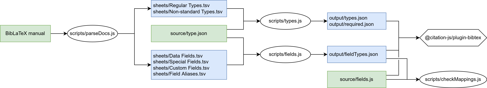

  - `scripts/parseDocs.js` -- generate data sheets from the biblatex manual
  - `sheets/*.tsv` (generated\*) -- data sheets
  - `scripts/types.js` -- generate type maps from manual type maps and data sheets
  - `source/*.json` -- manual type maps
  - `output/*.json` (generated) -- types
  - `scripts/checkMapping.js` -- check whether all mappings that need a converter have one

\* generated from the biblatex manual (LPPL Version 1.3c). Changes include and are limited to extraction and transformation of lists of types and fields into TSV data sheets.
